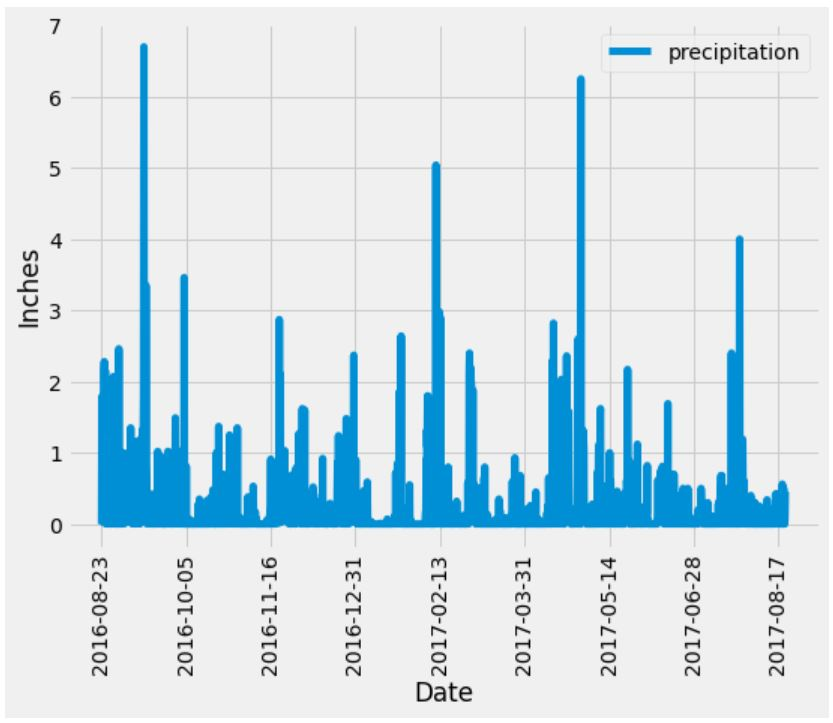
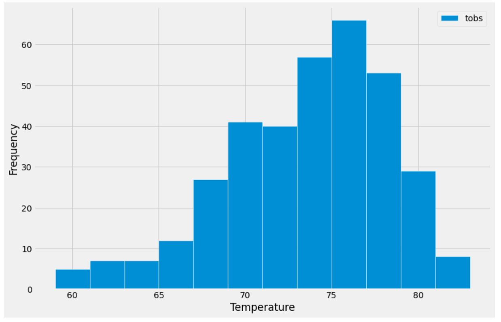
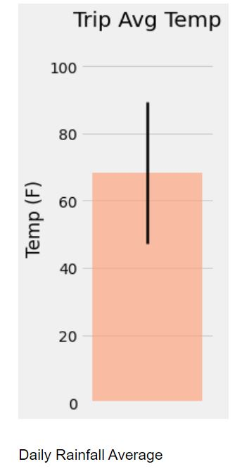
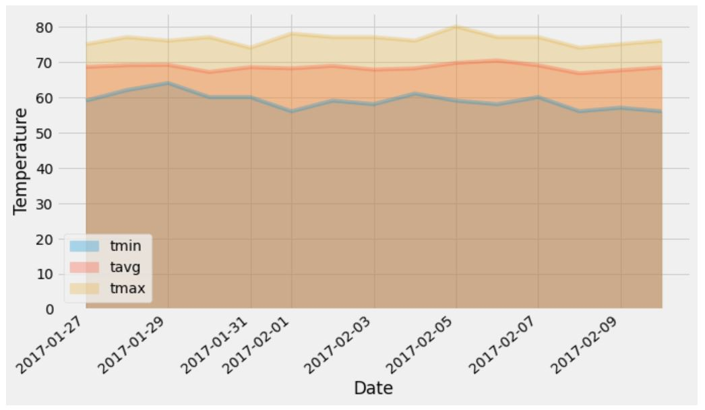

# Hawaii climate analysis with SQLAlchemy
SQLAlchemy project for Monash Data Analytics Boot Camp

The purpose of this project was to do a basic climate analysis and data exploration of Hawaii climate database.

# Data

There is one key source of data used:

* [hawaii.sqlite](Resources/hawaii.sqlite) - .sqlite database composed of two tables: `measurement` and `station`

# Analysis

* Use SQLAlchemy to connect to sqlite database

* Reflect database tables into classes

### Precipitation Analysis

* Design a query to retrieve the last 12 months of precipitation data

* Select only the `date` and `prcp` values

* Load the query results into a Pandas DataFrame and set the index to the date column

* Sort the DataFrame values by `date`

* Plot the results:

* Print the summary statistics for the precipitation data

### Station Analysis

* Design a query to calculate the total number of stations

* Design a query to find the most active stations

* Design a query to retrieve the last 12 months of temperature observation data (TOBS)

  * Filter by the station with the highest number of observations

  * Plot the results as a histogram with `bins=12`:

### Temperature Analysis I

* Identify the average temperature in June at all stations across all available years in the dataset; Do the same for December temperature

* Use the t-test to determine whether the difference in the means, if any, is statistically significant

### Temperature Analysis II

* Use the `calc_temps` function to calculate the min, avg, and max temperatures for your trip using the matching dates from the previous year

* Plot the min, avg, and max temperature from your previous query as a bar chart:

  * Use the average temperature as the bar height

  * Use the peak-to-peak (TMAX-TMIN) value as the y error bar (YERR)

### Daily Rainfall Average

* Calculate the rainfall per weather station using the previous year's matching dates

* Calculate the daily normals. Normals are the averages for the min, avg, and max temperatures

* Create a list of selected trip dates in the format `%m-%d`; Use the `daily_normals` function to calculate the normals for each date string and append the results to a list

* Load the list of daily normals into a DataFrame and set the index equal to the date

* Plot an area plot (`stacked=False`) for the daily normals:

  

# Climate App

* Create Flask API based on the previous queries

### Routes

* `/`

  * Home page
  * List all routes that are available

* `/api/v1.0/precipitation`

  * Convert the query results to a dictionary using `date` as the key and `prcp` as the value
  * Return the JSON representation of your dictionary

* `/api/v1.0/stations`

  * Return a JSON list of stations from the dataset

* `/api/v1.0/tobs`
  * Query the dates and temperature observations of the most active station for the last year of data
  * Return a JSON list of temperature observations (TOBS) for the previous year

* `/api/v1.0/<start>` and `/api/v1.0/<start>/<end>`

  * Return a JSON list of the minimum temperature, the average temperature, and the max temperature for a given start or start-end range
  * When given the start only, calculate `TMIN`, `TAVG`, and `TMAX` for all dates greater than and equal to the start date
  * When given the start and the end date, calculate the `TMIN`, `TAVG`, and `TMAX` for dates between the start and end date inclusive

# Demo

To run the example locally run the `climate_starter.ipynb` file in Jupyter Notebook. To use the Climate App run `python app.py` in command line and visit `http://localhost:5000/`.

# Used Tools
 * Jupyter Notebook 
 * Pandas
 * Numpy
 * Scipy 
 * Matplotlib
 * SQLAlchemy  
 * PostgreSQL

#

#### Contact: mil.haszek@gmail.com